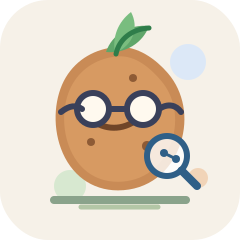
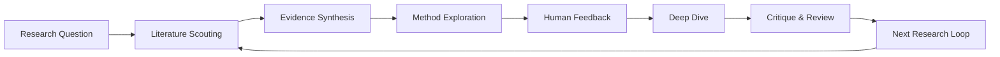

<p align="center">
  
</p>

<h1 align="center">CoResearcher</h1>

<p align="center">
  <strong>A Human-in-the-Loop Deep Research Agent for Scientific Discovery.</strong>
</p>

<p align="center">
  <em>一个会调研、会讨论、会质疑、会陪你逐步收敛研究方向的科研搭子。</em>
</p>

---

## 项目简介

CoResearcher 是一个面向科研场景的深度研究智能体。它不是简单的文献总结工具，也不是“一键生成论文”的自动化流水线，而是一个强调 **Human-in-the-Loop** 的科研协作者。

它围绕「调研 - 分析 - 讨论 - 选择 - 深挖 - 质疑 - 迭代」构建，让 AI 参与真实科研过程，而不是只在最后输出一份静态报告。

## 为什么需要 CoResearcher？

很多 Deep Research Agent 更像自动化报告生成器：用户提出问题，系统检索文献，生成总结，然后对话结束。

但真实科研往往不是线性的。研究者真正需要的是一个能持续陪伴思考的系统：

- 澄清一个模糊问题是否值得研究；
- 判断已有文献到底解决了什么、没解决什么；
- 发现可能的方法切入点；
- 和 AI 反复讨论可行性、创新性与风险；
- 在不同研究方向之间做取舍；
- 逐步形成可执行的研究路线。

CoResearcher 的目标是把 AI 从“报告生成器”推进到“共同研究者”。

## 核心理念

CoResearcher 将科研过程建模为一个持续演化的研究状态，而不是一次性问答。



## 功能特性

- **Human-in-the-Loop Research Flow**  
  在关键节点引入用户反馈，包括问题定义、方向选择、方法取舍和结论审核。

- **Literature Intelligence**  
  检索、解析和组织论文，构建文献矩阵、方法谱系、证据链和研究空白。

- **Research State Memory**  
  持续维护研究问题、假设、已读文献、候选方法、用户偏好和决策记录。

- **Method Exploration**  
  根据文献和用户目标生成可探索方法，并分析创新性、可行性和实验风险。

- **Devil's Advocate Review**  
  从审稿人和反方视角质疑当前想法，检查 novelty、validity、feasibility 和 evidence gap。

- **Iterative Research Loop**  
  支持多轮推进，而不是每次都从一份总结文档重新开始。

## 系统架构

| Module | Description |
| --- | --- |
| Research Planner | 将用户问题拆解为阶段性研究任务 |
| Literature Agent | 检索、筛选、阅读和总结相关论文 |
| Synthesis Agent | 形成文献矩阵、研究空白和方法对比 |
| Method Explorer | 生成候选研究方向和初步技术路线 |
| Human Feedback Manager | 收集用户反馈并更新研究状态 |
| Critic Agent | 从审稿人和反方视角评估方案 |
| Research Memory | 保存长期研究上下文和决策轨迹 |

## 示例工作流

用户输入：

> 我想研究 LLM Agent 在科研发现中的应用，但不确定可以从哪个角度切入。

CoResearcher 会逐步完成：

1. 澄清研究目标和领域边界；
2. 调研相关论文和已有系统；
3. 总结当前方法、局限和争议；
4. 提出多个候选研究方向；
5. 与用户讨论每个方向的价值和风险；
6. 根据用户反馈深入一个方向；
7. 生成实验设想、baseline、数据需求和评估指标；
8. 用审稿人视角检查方案漏洞；
9. 进入下一轮研究迭代。

## 与全自动科研 Agent 的区别

| Dimension | Fully Autonomous Research Agent | CoResearcher |
| --- | --- | --- |
| Goal | 自动完成研究流程并生成论文 | 辅助研究者逐步形成研究判断 |
| Human Role | 初始输入者 | 持续参与者和决策者 |
| Output | 报告、论文、代码 | 研究状态、方法路线、讨论记录、可执行计划 |
| Strength | 自动化效率 | 不确定问题中的协同推理 |
| Best For | 结构化分析任务 | 开放式科研探索任务 |

## 图标说明

项目图标是一个“小土豆科研员”：

- 土豆主体来自昵称“小土豆儿”，保留一点个人印记；
- 嫩芽表示研究想法的生长；
- 眼镜和放大镜表示文献阅读、证据检索和审稿式检查；
- 节点连线表示知识图谱、证据链和研究状态演化。

图标文件位于：

```text
assets/coresearcher-potato.svg
```

## Roadmap

- [ ] Paper parser and citation graph
- [ ] Literature evidence matrix
- [ ] Research state memory
- [ ] Human feedback checkpoints
- [ ] Method exploration agent
- [ ] Reviewer / Devil's Advocate agent
- [ ] Experiment planning module
- [ ] Research notebook interface

## Project Status

CoResearcher is currently in the design and prototyping stage.

The first milestone is to build a minimal human-in-the-loop research loop:

```text
question -> literature review -> synthesis -> method candidates -> user feedback -> deep dive -> critique
```

## License

This project is released under the MIT License.
